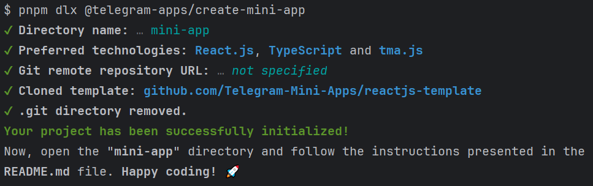
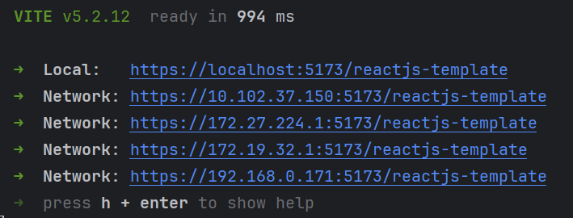

# Creating New App

Developing a new web application is a rather complex process. Most of the time, it involves creating
both front-end and back-end parts of the project, each consisting of its own small components. It is
common knowledge that web applications are developed with usual browsers in mind, such as Google
Chrome, Safari, Firefox, etc. We can't really say that these browsers differ a lot from each other,
so when developing web applications, we expect to work in almost the same environment.

Nevertheless, when we talk about Telegram Mini Apps, it provides its own web-based environment
with specific traits and mechanisms. So, in this article, we will look at how developers can start
developing their applications on this platform and demonstrate that it is not really difficult.

In this guide, we will do the following:

- Use a special tool for scaffolding the application.
- Run the application and obtain a development link, so we can develop comfortably.
- Run the application both inside and outside Telegram.
- Create a new application in [@BotFather](https://t.me/botfather).
- Create a GitHub repository, configure it, and deploy the application.
- See the application working in production, become happy because we have found out that it was
  easy ❤️

## Scaffold Application

To scaffold an application, we should use a CLI tool
named [@telegram-apps/create-mini-app](https://docs.telegram-mini-apps.com/packages/telegram-apps-create-mini-app).
It prompts the developer with some questions, after which a new application will be initialized in
the specified folder.

To run it, use one of the following commands and complete the initialization process. For
educational purposes, use the technologies combination of `tma.js`, `React.js`, and `TypeScript`.

::: code-group

```bash [pnpm]
pnpm dlx @telegram-apps/create-mini-app@latest
```

```bash [npm]
npx @telegram-apps/create-mini-app@latest
```

```bash [yarn]
yarn create @telegram-apps/mini-app
```

:::

Here is the output example, you will see in your console:



From now on, we have a **mini-app** folder containing our mini application. Let's navigate to this
folder and install the dependencies:

```Bash
# Go to directory.
cd mini-apps

# Install dependencies.
npm i
```

You are probably curious about what technologies exactly are being used by this application. So,
here is the list of the most important ones:

- [React](https://react.dev/): A library for building web interfaces.
- [TypeScript](https://www.typescriptlang.org/): A typed alternative to JavaScript.
- [TON Connect](https://docs.ton.org/develop/dapps/ton-connect/overview): A library for connecting
  your mini app with the user's wallet.
- [@tma.js SDK](https://docs.telegram-mini-apps.com/packages/tma-js-sdk): Telegram Mini Apps Source
  Development Kit built from scratch.
- [Telegram UI](https://github.com/Telegram-Mini-Apps/TelegramUI): A library for constructing
  interfaces that look native to the Telegram interface.
- [Vite](https://vitejs.dev/): A powerful bundler that helps you build your application.

::: tip

Initialized project root directory contains the **README.md** file answering a lot of questions.
In case you have some, refer to this file.

:::

## Run Application

To run the development server, use the `dev` script:

```Bash
npm run dev
```

You will see a similar output:



Let's clarify, what these links are.

Our application uses such Vite plugin
as [@vitejs/plugin-basic-ssl](https://www.npmjs.com/package/@vitejs/plugin-basic-ssl). Its main
purpose is to provide an ability to get a link with the HTTPS protocol. You can disable it, but
in this case, you will only be allowed to view the application outside Telegram. This way of
developing application is considered worse, as long as you will not be able to use all Telegram
Mini Apps features and check, how they work in real world. Nevertheless, disabling the plugin
is not prohibited.

It is worth mentioning,
that you are not able to use non-HTTPS links inside Telegram. So, you must have one.

Nevertheless,

is to allow us to use SSL and retrieve a link with the HTTPS protocol.

## GitHub Repository

Each project starts with a storage we use to keep our codebase in. It can be any known project -
BitBucket, GitLab, GitHub, etc. Such projects help us to configure CI/CD, track code changes
and many more.

In this guide, we will use GitHub as our codebase storage.

In case, you still don't have an account, follow the
GitHub's [Sign Up page](https://github.com/signup) and create a new one.

When account is created, let's create a new repository.

## Create Application in BotFather

As long as technically, Mini Apps are connected with Telegram bots, we should firstly create
a Telegram bot. To do this, you need to find the father of all bots, the
bot [BotFather](https://t.me/botfather) and use the command `/newbot`, then go through the proposed
process, specifying all the necessary data.

When the bot is created, it is required then to use the command `/newapp` and again go through the
procedure of creating another entity - the Telegram Mini Apps application, linking it to the
Telegram bot. When BotFather will request the application link, just specify some temporary link.
For example - `https://example.com`.

From now on, the created application will be available via a direct link of the
form `https://t.me/{mybot}/{myapp}`.

::: info

Telegram Mini Apps technology can also be utilized without creating a new application but rather as
a web interface for a bot. To use it as an extension of the bot, use the
BotFather's `/setmenubutton` command. In this case we will be able to open the application
just clicking the Menu Button.

:::

## Web Application Link

Before reading this section, make sure that you have already created a frontend application
that can be accessed via a direct link.

### Obtaining

To learn more about obtaining a link for your Mini App, refer to [this](getting-app-link.md)
article.

### Applying

When HTTPS link is received, it must be used in a previously created Telegram bot. Telegram
supports several ways to install this link:

- **For the bot menu button**. Then every user who will enter a dialogue with the bot will be able
  to open its "menu" in the form of a developed application.
- **For Telegram Mini Apps application**. Then the application will open only if the user
  follows the link in format `https://t.me/{mybot}/{myapp}`. In this case, user can avoid joining
  a dialogue with the bot.

#### Menu Button

To set the link on the menu button, you need to go to the dialog with BotFather and use
the command (send a message) `/setmenubutton`. Next, BotFather will ask you to select a bot, specify
a link, as well as a title for the menu button.

As a result, when a user enters a chat with a bot, he will be able to open a web application by
clicking on the menu button on the bottom left in the interface.

#### Direct Link

To install a direct link to the application, you must complete the following steps:

1. Send the BotFather command `/myapps`.
2. Select the required application.
3. Click `Edit link` and install a new link.

Now when the user clicks on a link in format `https://t.me/{mybot}/{myapp}`, Telegram
will display the web component with the source address as the URL specified in the settings.

## Debugging Application

Sometimes, it is necessary to debug the developed application. To learn more, refer
to [this](debugging.md) article.

[//]: # (## Additional)

[//]: # ()

[//]: # (### Hot Module Replacement)

[//]: # ()

[//]: # (The application development process is a fairly complex and lengthy process. You always want to see)

[//]: # (the changes you make in the code right away on the screen. In order to see the changes in real time,)

[//]: # (it is necessary to use such a technique as **Hot Module Replacement**. This section will not cover)

[//]: # (the process of setting it up, as it often depends on the project, but well-known frameworks already)

[//]: # (include this functionality by default.)

[//]: # ()

[//]: # (How to configure HMR can be found)

[//]: # (in [this Webpack article]&#40;https://webpack.js.org/guides/hot-module-replacement/&#41;.)

[//]: # (## Заключение)

[//]: # ()

[//]: # (Этого вполне достаточно для того, чтобы создать свое первое приложение TWA.)

[//]: # (Тем не менее, данный гайд не покрывает все особенности платформы, а лишь)

[//]: # (помогает избежать бесполезной траты времени на базовые и простые проблемы.)

[//]: # (## Debugging application)

[//]: # ()

[//]: # (As long as Web Apps are web applications, and they are opened in some native)

[//]: # (components &#40;not in browser&#41;, we are not allowed to debug them in common way as)

[//]: # (we do it in browser applications until some additional actions are done.)

[//]: # ()

[//]: # (To enable debug mode in native application follow)

[//]: # ([official documentation]&#40;https://core.telegram.org/bots/webapps#debug-mode-for-web-apps&#41;)

[//]: # (.)